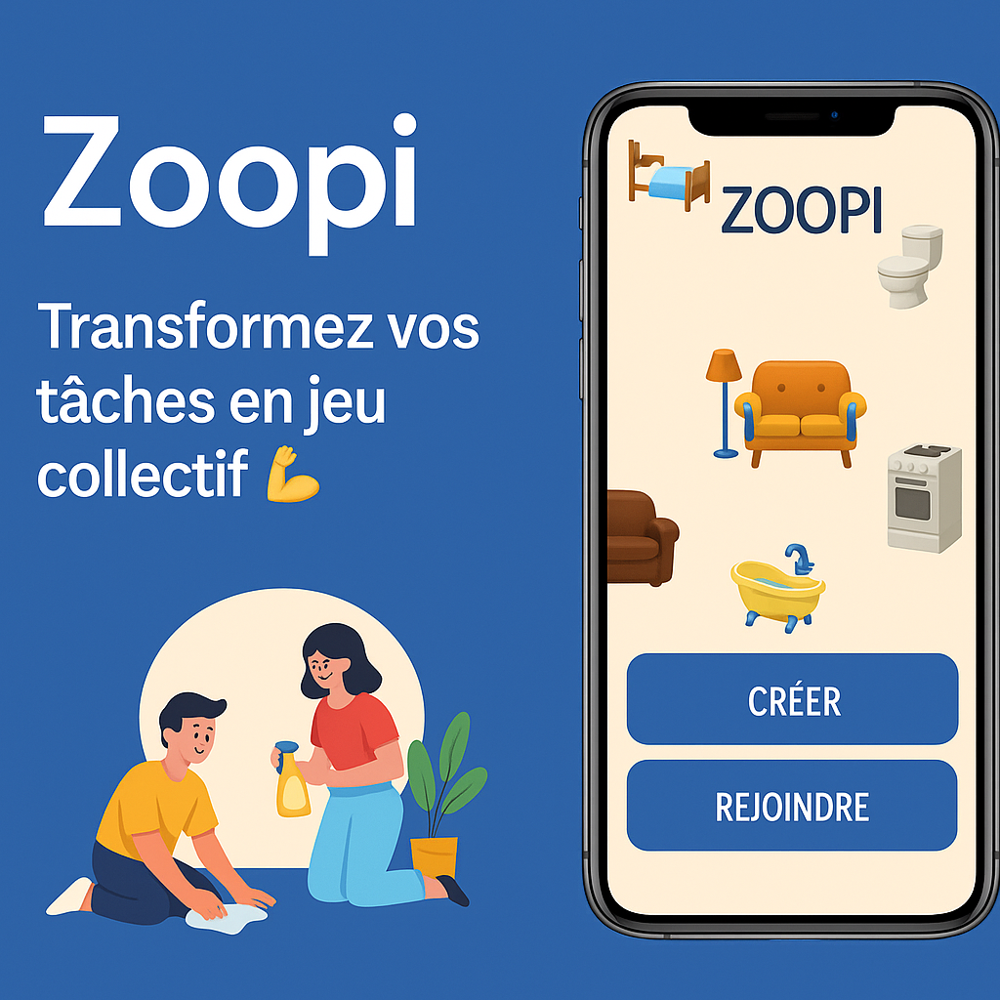

# Zoopi – La nouvelle manière de gérer les tâches… en s’amusant !

## **Pourquoi ce projet ?**

Aujourd’hui, la gestion des tâches ménagères crée plus de tensions que de coopération :
déséquilibre dans la répartition, oublis, reproches, manque de visibilité…
Et pourtant, 82% des colocations déclarent que _“la gestion des tâches est une source de conflit”_ (Insee, 2024).

Les familles et colocations cherchent des solutions simples, motivantes et modernes.
Et si organiser son foyer devenait **fun**, **équitable** et **gamifié** ?

Avec **Zoopi**, nous développons une application mobile qui transforme les tâches quotidiennes en un **jeu collaboratif**, grâce à :

### ✅ Un système de points, défis, niveaux et classements

### ✅ Une répartition intelligente des tâches entre les membres

### ✅ Des notifications “façon Duolingo” qui taquinent l’utilisateur

### ✅ Une expérience fluide, gamifiée et motivante

### ✅ Des récompenses réelles via des partenariats (réductions produits ménagers / électroménager)

👉 **Un concept déjà testé : nous avons un MVP fonctionnel**, réalisé lors d’un premier cycle projet.
L’idée est validée, l’architecture existe déjà — maintenant, nous voulons **le professionnaliser, le scaler**, et en faire un **vrai produit démontrable** sur 18 mois.

---

## **Pourquoi rejoindre l’aventure ?**

### **Techno :**

React Native, Node.js (TypeScript), PostgreSQL, Docker, CI/CD, WebSockets, offline-first, IA légère…
👉 Des compétences _ultra demandées_ en entreprise.

### **Impact :**

Une vraie problématique de société : comment mieux s’organiser à la maison ?
Zoopi apporte une solution simple, ludique et intelligente.

### **Opportunités :**

Nous recrutons **plusieurs développeurs** pour constituer une équipe robuste et ambitieuse.

### **Ambition :**

Nous voulons intégrer des fonctionnalités avancées comme :

- Défis dynamiques type “missions du jour”
- Algorithme de répartition équitable
- Détection de charge de travail injuste
- Prévisions IA (habitudes, disponibilité, heure idéale pour faire une tâche)
- Mode hors-ligne complet + synchronisation intelligente
- Partenariats avec API marques (coupons et récompenses)
- Dashboard analytics du foyer
- Mise à jour temps réel via WebSockets

### **Encadrement :**

Projet MSc Epitech Nice, avec:

- livrables clairs
- roadmap technique longue
- soutenances intermédiaires
- suivi sérieux

---

## **On recherche des talents motivés !**

Vous êtes étudiant(e) en MSc et vous voulez :

- 🔥 développer une application mobile complète (front + back) ?
- 🔥 travailler sur des fonctionnalités avancées (temps réel, offline-first, IA) ?
- 🔥 participer à un projet qui a déjà un MVP et qui va devenir un vrai produit scalable **et** commercialisable? ?
- 🔥 rejoindre une équipe motivée, déjà soudée et expérimentée ?

### 👉 Rejoignez-nous pour construire l’app qui réinvente la vie quotidienne !

---

## **📌 Rôles ouverts :**

- **1 développeur mobile (React Native)**
- **2 développeurs backend Node.js / API**
- **1 développeur data / IA légère**
- **1 UI/UX designer** _(optionnel mais apprécié)_

---

## **Ce qu’on offre :**

- Un environnement sérieux, motivant et bien organisé
- Un MVP existant sur lequel baser vos développements
- Une expérience solide à ajouter à votre portfolio
- Une stack moderne, propre, scalable
- Une ambiance de travail bienveillante + réunions hebdo pro

---

## **Chiffres clés (pour vous convaincre !)**

| Statistique                                                                   | Source                 |
| ----------------------------------------------------------------------------- | ---------------------- |
| 82% des colocations font face à des conflits liés aux tâches                  | Insee 2024             |
| 68% des utilisateurs d’apps de productivité veulent plus de gamification      | Duolingo Research 2023 |
| 74% des foyers trouvent les outils classiques (tableaux, post-it) inefficaces | Ipsos 2023             |

---

## **Comment nous rejoindre ?**

### Découvrez le projet :

- 📎 Notre repo GitHub (MVP existant, code, docs, roadmap organisationnelle) #j'ai rien mis encore
- 📎 Notre petit pitch deck (version 5 slides)

### Postulez :

Envoyez-nous un message avec :

- Votre rôle souhaité
- Vos compétences
- Ce qui vous motive

Un entretien de **15 minutes** vous sera proposé pour faire connaissance !

- 📩 **Contact :** [luiza.nobrega@epitech.eu](mailto:luiza.nobrega@epitech.eu) & [axel1.huguet@epitech.eu](mailto:axel1.h-uguet@epitech.eu)
- 💼 **LinkedIn :** [Luiza](https://www.linkedin.com/in/luiza-nobrega-felix/) & [Axel](https://www.linkedin.com/in/axel-huguet/)

---

## **Pour aller plus loin**

👉 Pourquoi la gamification améliore réellement la motivation (Psychology Today)
👉 Comment les apps offline-first transforment l’expérience utilisateur (Smashing Magazine)
👉 Étude : Organisation familiale et charge mentale (Insee)

---

## **Réagissez !**

Vous pensez que la gamification peut améliorer la vie quotidienne ? 👍
Vous avez des idées de fonctionnalités à ajouter ? 💡
Vous voulez rejoindre Zoopi ? Écrivez-nous !

**“Et si rendre son foyer plus agréable… devenait aussi ludique qu’un jeu mobile ?” – Zoopi**
